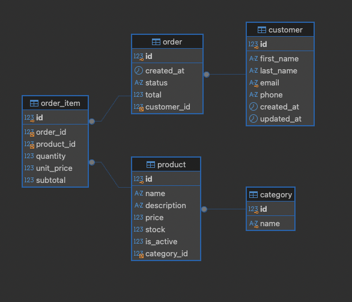

# ☕ Coffee Shop API — Spring Boot

¡Bienvenido al repositorio principal del sistema backend para **Coffee Shop**! Este proyecto forma parte de la arquitectura de servicios RESTful orientada a gestionar las operaciones esenciales de la cafetería: clientes, catálogo, pedidos, inventario, promociones y cobros.

---

## 📌 Alcance del Proyecto

El sistema centraliza las operaciones clave mediante **5 servicios backend principales**:

1. **Servicio de Clientes:** Registro, consulta y seguimiento de la información de clientes.
2. **Servicio de Productos:** Gestión del menú de bebidas, postres y sándwiches (precios, disponibilidad y stock).
3. **Servicio de Categorías de Productos:** Clasificación y organización del catálogo general.
4. **Servicio de Órdenes:** Levantamiento de pedidos por mesa/cliente, asignación de empleado/atención y procesamiento final del pago.

---

## 🛠️ Stack Tecnológico Proyectado

* **Lenguaje:** Java 17+ / Java 21
* **Framework Backend:** Spring Boot 3.x
  * Spring Data JPA (Persistencia)
  * Spring Web (API RESTful)
  * Spring Validation (Validación de DTOs)
  * Spring Security (Autenticación / Autorización) (Deseable)
* **Base de Datos:**  MySQL
* **Documentación:** Swagger UI
* **Herramientas:** Maven/Gradle, Docker Desktop, IntelliJ IDEA

---

## 🗄️ Modelo Entidad-Relación (ERD)

El modelo de datos cubre el flujo completo de venta desde la selección de cliente hasta la generación de la orden.

